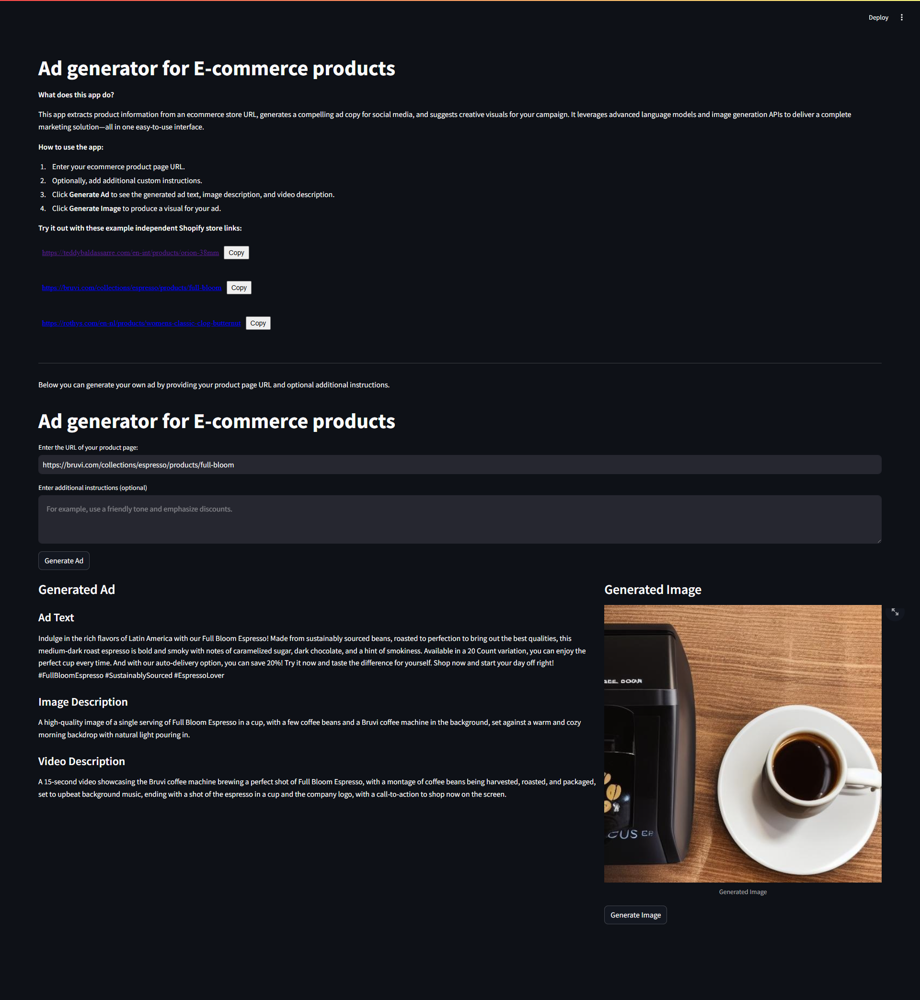

# Ad generator for E-commerce products

## Overview

**Ad generator for E-commerce products** is an end-to-end solution designed to help independent e-commerce store owners quickly generate professional ad copy and creative visuals for social media marketing. The application extracts product data from a store URL, uses prompt engineering with large language models (LLMs) to generate compelling ad copy and creative descriptions, and then creates visuals using generative AI.

## Highlights

- **Data Extraction & Web Scraping:** Extracts product details (name, brand, variations, etc.) from e-commerce pages.
- **Prompt Engineering:** Uses refined prompts with LLMs to produce high-quality ad copy and creative descriptions.
- **Image Generation:** Integrates with hosted image generation APIs (Replicate/Hugging Face) to create ad visuals.
- **Unified Interface:** Combines a FastAPI backend with a Streamlit frontend for a user-friendly experience.
- **Containerization:** Fully Dockerized for easy deployment.

## Technologies Used

- **Backend:** FastAPI, Uvicorn
- **Frontend:** Streamlit
- **Containerization:** Docker, Supervisor
- **Data Processing:** Python, Requests, BeautifulSoup4
- **AI Components:** LLMs for prompt engineering, Replicate/Hugging Face for image generation
- **Additional Libraries:** Pydantic, python-dotenv, Pillow

## Screenshot

  

## How to Use

1. **Enter Store URL:** Paste your e-commerce product page URL into the input field.
2. **Additional Instructions (Optional):** Provide any custom instructions to tailor the ad copy.
3. **Generate Ad:** Click the **Generate Ad** button to fetch product details and generate ad text, image description, and video description.
4. **Generate Image:** Once the ad details are displayed, click the **Generate Image** button to produce a visual based on the image description.

## Running Locally

### Prerequisites

- **Python 3.10+**
- **Docker** (for containerized deployment)
- API keys stored in a `.env` file (see instructions below)

### Setup with Docker

1. **Clone the Repository:**

   ```bash
   git clone https://github.com/fayezhesham/AI_ad_generator.git
   cd ad_generator
2. **Create a `.env` File in the Root Directory:**

   ```bash
   GROQ_API_KEY= Your api key
   HUGGING_FACE_API_KEY= Your api key
3. **Build the Docker Image:**

   ```bash
   docker build -t ad_generator_app .
4. **Run the Container:**

   ```bash
   docker run -p 8000:8000 -p 8501:8501 ad_generator_app
5. Accecss the app at: http://localhost:8501
